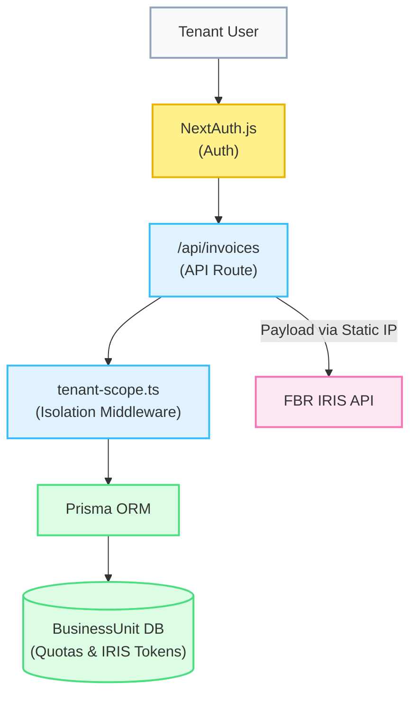

# FBR SyncPro (FBR Digital Invoicing)

FBR SyncPro is a powerful, Next.js based application designed to seamlessly integrate with the Pakistan Federal Board of Revenue (FBR) Digital Invoicing system (IRIS). It allows businesses to manage inventory, customers, and stock, while generating FBR-compliant invoices in real-time.

## 🚀 Key Features

### 🏢 Multi-Tenant SaaS Architecture & Super Admin
- **Data Isolation:** Seamlessly scales to host multiple clients on a single instance using `scopedDb` middleware ensuring complete data isolation.
- **Resource Management:** Super Admin dashboard to allocate VPS storage limits and track invoice quotas per client.
- **IRIS Token Segregation:** Each client configures their own FBR IRIS tokens (Sandbox/Production) secured behind authentication, eliminating the need for separate hosting environments.

### 1. 📝 Smart Invoice Generation
- **Auto-Fill Details**: Enter a Customer NTN/CNIC and the system automatically fills in their registered business name, province, and address.
- **Stock-Aware Item Picker**: Easily select items from a pop-up checklist. The invoice automatically locks descriptive fields to prevent tampering, requiring only Qty and Rate.
- **Live Stock Validations**: Real-time stock tracking inside the invoice form. If an item drops to negative stock, the system forces the user to provide a mandatory justification reason.
- **FBR Validation (Dry Run)**: Validates the entire invoice structure against FBR's official `postinvoicedata` Schema v1.12 before submission.

### 2. 🕒 Invoices Dashboard & 72-Hour Timer
- View a complete list of all issued invoices and their syncing status.
- **Live FBR Countdown**: FBR enforces a strict 72-hour window for invoice cancellations. The dashboard features a live ticking timer for each invoice that turns orange near expiration, and locks (🔒) automatically when the 72 hours have passed.

### 3. 📦 Stock & Inventory Management
- Add products and services with mandatory FBR variables like HS Code, UOM, and Sale Type.
- **Live Stock Ledger**: Dedicated stock reporting page displaying IN/OUT history, invoice references, and running balances for every item.

### 4. 👥 Customer Management
- Maintain a database of registered and unregistered buyers.
- Enforces NTN checks for Registered buyers as per FBR rules.
- **WHT Support**: Built-in logic to optionally apply a 0.10% Withholding Tax automatically on invoices depending on vendor profiles.

### 5. ☁️ Bulk Excel Uploads
- APIs to download pre-formatted Excel templates (with sample data) for Invoices, Customers, and Items.
- Built-in parsing engine designed to dynamically group multi-item invoices by `InvoiceNo` and validate taxation math.

### 6. 🎨 Dynamic Theme Settings
- **Customizable Brand Colors**: Configure your business profile and switch the entire application's theme instantly using CSS Variables without hardcoded Tailwind classes.

### 7. 🗓️ Holiday Validation Engine
- **Sunday Blockers & Gazetted Holidays**: Live integration with Google Calendar `basic.ics` feeds. Validates invoice issuance dates to prevent backdating on Sundays or official holidays without a mandatory logged reason.

## 🏗️ System Architecture



## 🛠️ Technology Stack
- **Framework**: Next.js 15+ (App Router)
- **Styling**: Tailwind CSS & Base UI / Lucide Icons
- **Database**: PostgreSQL (via Prisma ORM)
- **Language**: TypeScript

## 🏁 Getting Started

First, run the development server:

```bash
npm run dev
# or
yarn dev
# or
pnpm dev
# or
bun dev
```

Open [http://localhost:3000](http://localhost:3000) with your browser to see the dashboard.

## 📜 FBR Compliance Notes
- Duplicate detection is handled locally before hitting the PRAL API.
- Decimal points are strictly rounded to 2 places for monetary values and 4 places for quantities to avoid float-rejection from FBR servers.
- The `scenarioId` payload parameter is restricted to Sandbox environments.
