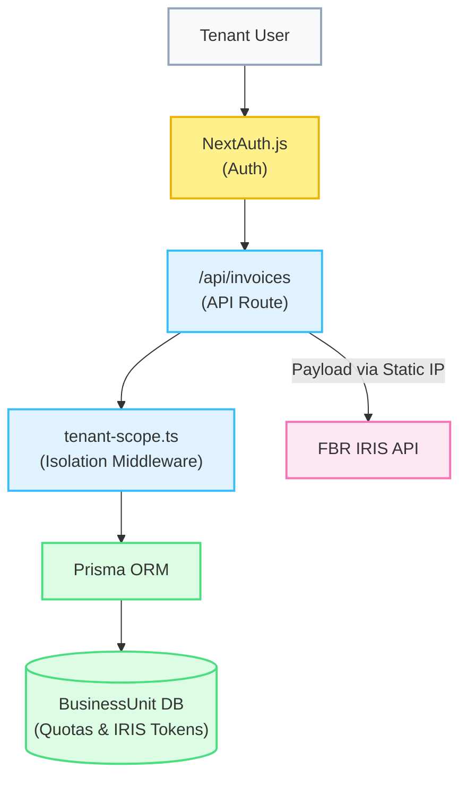

# FBR SyncPro - Enterprise Digital Invoicing SaaS

**FBR SyncPro** is an enterprise-grade Software as a Service (SaaS) platform engineered to streamline compliance with the Pakistan Federal Board of Revenue's (FBR) Digital Invoicing system (IRIS). It serves as an intelligent bridge between business operations and government tax APIs, ensuring 100% compliance while minimizing administrative friction.

---

## 🎯 Project Vision
With the FBR mandating digital invoicing across various sectors, businesses faced a critical challenge: integrating complex APIs into their existing, often fragmented, workflows. **FBR SyncPro** was built to solve this by providing a unified, multi-tenant portal where businesses can generate invoices, manage stock, and automatically sync with the FBR in real-time, without requiring technical expertise.

## 🏗️ Core Architecture & Infrastructure

FBR SyncPro utilizes a highly scalable **Multi-Tenant SaaS Architecture**. 
To optimize infrastructure costs without sacrificing data privacy, the application hosts multiple clients on a single Hostinger VPS. 

### Why a Single Static IP?
The FBR IRIS system requires API requests to originate from a whitelisted Static IP. By centralizing the application on a single VPS, we utilize a **Shared Static IP** architecture. 
1. **The FBR Requirement:** The FBR authenticates based on the IP *plus* the Client's NTN and API Token.
2. **The Solution:** Our single VPS acts as the whitelisted hub. Each client logs into the application, securely configures their own FBR API Tokens (Sandbox/Production), and the application intelligently routes the payload using the active tenant's credentials.

### Data Security (The `scopedDb` Middleware)
In a shared database environment, preventing data leakage between tenants is paramount. FBR SyncPro implements a custom **Data Isolation Middleware (`scopedDb`)**. 
- Every API request passes through `NextAuth` to verify the user's session and `businessUnitId`.
- The `scopedDb` wrapper intercepts Prisma ORM calls, automatically injecting strict tenant boundaries (e.g., `where: { businessUnitId: session.businessUnitId }`).
- This guarantees mathematically proven isolation: Tenant A cannot fetch, modify, or delete Tenant B's data under any circumstance.

---

## 🌟 Key Features

### 1. FBR Logic & Compliance Engine
The app isn't just an API wrapper; it enforces FBR business rules before a request ever leaves the server.
- **72-Hour Cancellation Rule:** FBR strictly prohibits invoice cancellation after 72 hours. The app features a live, ticking dashboard timer. Once 72 hours pass, the invoice is permanently locked (🔒).
- **Holiday & Sunday Blockers:** Integrated with Google Calendar ICS feeds to prevent backdating invoices on gazetted holidays and Sundays unless an authorized justification is provided.
- **WHT Integration:** Automatically applies 0.10% Withholding Tax dynamically based on user and vendor profiles.

### 2. Super Admin & Quota Management
A dedicated `/admin` dashboard empowers the platform owner to manage SaaS subscribers effectively.
- **VPS Resource Allocation:** Distribute server storage quotas (e.g., 500MB, 1GB) among clients.
- **Live Limits Tracking:** Tenants see a progress bar indicating their storage usage on their dashboard. If a tenant exceeds their storage limit or monthly invoice limit, the `scopedDb` layer blocks new invoice creation immediately.

### 3. Inventory & Customer Management
- **Stock-Aware Invoicing:** A real-time item picker that deducts stock upon invoice generation. Negative stock triggers mandatory justification workflows.
- **NTN Verification:** Ensures customers with valid NTNs are recorded as "Registered," a critical requirement for accurate Sales Tax Returns (Annexure C).

### 4. Enterprise Settings Security
API tokens are highly sensitive. The FBR Settings page is locked behind a strict NextAuth PIN/Password challenge. Even if a user leaves their session open, an unauthorized person cannot view or alter the FBR credentials.

---

## 💻 Tech Stack
- **Frontend & Backend Framework:** Next.js (App Router, React Server Components)
- **Authentication:** NextAuth.js (Session Management, JWTs)
- **Database:** PostgreSQL with Prisma ORM
- **Styling:** Tailwind CSS, Base UI, Recharts (for Analytics)
- **Language:** TypeScript (Strict Typing)

## 💡 Impact
FBR SyncPro transforms a highly technical and strict government compliance requirement into a seamless, automated experience for businesses. The multi-tenant architecture proves that enterprise-grade security and data isolation can be achieved cost-effectively, making this SaaS a highly scalable and robust solution.
